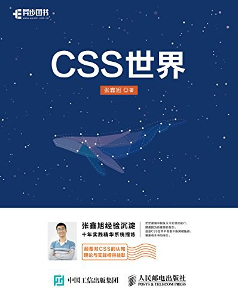

# CSS-World
Study notes and code implementations for a book called "CSS World".

《CSS 世界》的阅读笔记以及代码实现。

## Declaration
All the code in this repository is for study and reference only. Please do not use it for commercial purposes.

本仓库中的代码仅用于学习和参考，请勿用于商业用途。

All the notes in this repository are owned by the repository author. Please indicate the source when reposting.

本仓库中的笔记由仓库作者所有，转载请注明出处。

## Background
本书从前端开发人员的需求出发，以“流”为线索，从结构、内容到美化装饰等方面，全面且深入地讲解前端开发人员必须了解和掌握的大量的CSS知识点。同时，作者结合多年的从业经验，通过大量的实战案例，详尽解析CSS的相关知识与常见问题。作者还为本书开发了专门的配套网站，进行实例展示、问题答疑。

The book "CSS World" is a comprehensive guide for front-end developers, covering a wide range of CSS knowledge points from structure, content, to decorative design. The author, with over a decade of experience in front-end development, provides detailed explanations and practical examples to help readers understand and master CSS. The book also includes a dedicated website for instance display and problem-solving.

> ISBN: 9787115470669!
> 

## 目录

- 第 1 章  概述
  - 1.1 CSS 世界的“世界观”
  - 1.2 世界都是创造出来的
  - 1.3 CSS 完胜 SVG 的武器——流
    - 1.3.1 何为“流”
    - 1.3.2 流是如何影响整个 CSS 世界的
    - 1.3.3 什么是流体布局
  - 1.4 CSS 世界的开始从 IE8 开始
  - 1.5 ``table`` 自己的世界
  - 1.6 CSS 新世界——CSS3
- 第 2 章  需提前了解的术语和概念
  - 2.1 务必了解的 CSS 世界的专业术语
  - 2.2 了解 CSS 世界中的“未定义行为”
- 第 3 章  流、元素与基本尺寸
  - 3.1 块级元素
    - 3.1.1 为什么 ``list-item`` 元素会出现项目符号
    - 3.1.2 ``display:inline-table`` 的盒子是怎样组成的
    - 3.1.3 ``width/height`` 作用在哪个盒子上
  - 3.2 ``width/height`` 作用的具体细节
    - 3.2.1 深藏不露的 ``width:auto``
    - 3.2.2 ``width`` 值作用的细节
    - 3.2.3 CSS 流体布局下的宽度分离原则
    - 3.2.4 改变 ``width/height`` 作用细节的 ``box-sizing``
    - 3.2.5 相对简单而单纯的 ``height:auto``
    - 3.2.6 关于 ``height:100%``
  - 3.3 CSS ``min-width/max-width`` 和 ``min-height/max-height`` 二三事
    - 3.3.1 为流体而生的 ``min-width/max-width``
    - 3.3.2 与众不同的初始值
    - 3.3.3 超越 ``!important`` ，超越最大
    - 3.3.4 任意高度元素的展开收起动画技术
  - 3.4 内联元素
    - 3.4.1 哪些元素是内联元素
    - 3.4.2 内联世界深入的基础——内联盒模型
    - 3.4.3 幽灵空白结点
- 第 4 章  盒尺寸四大家族
  - 4.1 深入理解 ``content``
    - 4.1.1 ``content`` 与替换元素
    - 4.1.2 ``content`` 内容生成技术
  - 4.2 温和的 ``padding`` 属性
    - 4.2.1 ``padding`` 与元素的尺寸
    - 4.2.2 ``padding`` 的百分比值
    - 4.2.3 标签元素内置的 ``padding``
    - 4.2.4 ``padding`` 与图形绘制
  - 4.3 激进的 ``margin`` 属性
    - 4.3.1 ``margin`` 与元素尺寸以及相关布局
    - 4.3.2 ``margin`` 的百分比值
    - 4.3.3 正确看待 CSS 世界里的 ``margin`` 合并
    - 4.3.4 深入理解 CSS 中的 ``margin:auto``
    - 4.3.5 ``margin`` 无效情形解析
  - 4.4 功勋卓越的 ``border`` 属性
    - 4.4.1 为什么 ``border-width`` 不支持百分比值
    - 4.4.2 了解各种 ``border-style`` 类型
    - 4.4.3 border-color和color
    - 4.4.4 border与透明边框技巧
    - 4.4.5 border与图形构建
    - 4.4.6 border等高布局技术
- 第5章　内联元素与流
  - 5.1 字母x—CSS世界中隐匿的举足轻重的角色
    - 5.1.1 字母x与CSS世界的基线
    - 5.1.2 字母x与CSS中的x-height
    - 5.1.3 字母x与CSS中的ex
- 5.2 内联元素的基石line-height
    - 5.2.1 内联元素的高度之本—line-height
    - 5.2.2 为什么line-height可以让内联元素“垂直居中”
    - 5.2.3 深入line-height的各类属性值
    - 5.2.4 内联元素line-height的“大值特性”
- 5.3 line-height的好朋友vertical-align
    - 5.3.1 vertical-align家族基本认识
    - 5.3.2 vertical-align作用的前提
    - 5.3.3 vertical-align和line-height之间的关系
    - 5.3.4 深入理解vertical-align线性类属性值
    - 5.3.5 深入理解vertical-align文本类属性值
    - 5.3.6 简单了解vertical-align上标下标类属性值
    - 5.3.7 无处不在的vertical-align
    - 5.3.8 基于vertical-align属性的水平垂直居中弹框
- 第6章　流的破坏与保护
  - 6.1 魔鬼属性float
    - 6.1.1 float的本质与特性
    - 6.1.2 float的作用机制
    - 6.1.3 float更深入的作用机制
    - 6.1.4 float与流体布局
  - 6.2 float的天然克星clear
    - 6.2.1 什么是clear属性
    - 6.2.2 成事不足败事有余的clear
  - 6.3 CSS世界的结界—BFC
6.3.1 BFC的定义
6.3.2 BFC与流体布局
  - 6.4 结界overflow
    - 6.4.1 overflow剪裁界线border box
    - 6.4.2 了解overflow-x和overflow-y
    - 6.4.3 overflow与滚动条
    - 6.4.4 依赖overflow的样式表现
    - 6.4.5 overflow与锚点定位
  - 6.5 float的兄弟position：absolute
    - 6.5.1 absolute的包含块
    - 6.5.2 具有相对特性的无依赖absolute定位
    - 6.5.3 absolute与text-align
  - 6.6 absolute与overflow
  - 6.7 absolute与clip
    - 6.7.1 重新认识的clip属性
    - 6.7.2 深入了解clip的渲染
  - 6.8 absolute的流体特性
    - 6.8.1 当absolute遇到left/top/right/bottom属性
    - 6.8.2 absolute的流体特性
    - 6.8.3 absolute的margin：auto居中
  - 6.9 position：relative才是大哥
    - 6.9.1 relative对absolute的限制
    - 6.9.2 relative与定位
    - 6.9.3 relative的zui小化影响原则
  - 6.10 强悍的position：fixed固定定位
    - 6.10.1 position：fixed不一样的“包含块”
    - 6.10.2 position：fixed的absolute模拟
    - 6.10.3 position：fixed与背景锁定
- 第7章　CSS世界的层叠规则
  - 7.1 z-index只是CSS层叠规则中的一叶小舟
  - 7.2 理解CSS世界的层叠上下文和层叠水平
    - 7.2.1 什么是层叠上下文
    - 7.2.2 什么是层叠水平
  - 7.3 理解元素的层叠顺序 
  - 7.4 务必牢记的层叠准则 
  - 7.5 深入了解层叠上下文 
    - 7.5.1 层叠上下文的特性 
    - 7.5.2 层叠上下文的创建 
    - 7.5.3 层叠上下文与层叠顺序 
  - 7.6 z-index负值深入理解 
  - 7.7 z-index“不犯二”准则 
- 第8章　强大的文本处理能力 
  - 8.1 line-height的另外一个朋友font-size 
    - 8.1.1 font-size和vertical-align的隐秘故事 
    - 8.1.2 理解font-size与ex、em和rem的关系 
    - 8.1.3 理解font-size的关键字属性值 
    - 8.1.4 font-size：0与文本的隐藏 
  - 8.2 字体属性家族的大家长font-family 
    - 8.2.1 了解衬线字体和无衬线字体 
    - 8.2.2 等宽字体的实践价值 
    - 8.2.3 中文字体和英文名称 
    - 8.2.4 一些补充说明 
  - 8.3 字体家族其他成员
    - 8.3.1 貌似粗犷、实则精细无比的font-weight 
    - 8.3.2 具有近似姐妹花属性值的font-style 
    - 8.3.3 不适合国情的font-variant
  - 8.4 font属性
    - 8.4.1 作为缩写的font属性 
    - 8.4.2 使用关键字值的font属性 
    - 8.4.3 font关键字属性值的应用价值 
  - 8.5 真正了解@font face规则
    - 8.5.1 @font face的本质是变量
    - 8.5.2 @font face与字体图标技术
  - 8.6 文本的控制
    - 8.6.1 text-indent与内联元素缩进
    - 8.6.2 letter-spacing与字符间距
    - 8.6.3 word-spacing与单词间距
    - 8.6.4 了解word-break和word-wrap的区别
    - 8.6.5 white-space与换行和空格的控制
    - 8.6.6 text-align与元素对齐
    - 8.6.7 如何解决text-decoration下划线和文本重叠的问题
    - 8.6.8 一本万利的text-transform字符大小写
  - 8.7 了解：first-letter/：first-line伪元素
    - 8.7.1 深入：first-letter伪元素及其实例
    - 8.7.2 故事相对较少的：first-line伪元素
- 第9章　元素的装饰与美化
  - 9.1 CSS世界的color很单调
    - 9.1.1 少得可怜的颜色关键字
    - 9.1.2 不支持的transparent关键字
    - 9.1.3 不支持的currentColor变量
    - 9.1.4 不支持的rgba颜色和hsla颜色
    - 9.1.5 支持却鸡肋的系统颜色
  - 9.2 CSS世界的background很单调
    - 9.2.1 隐藏元素的background-image到底加不加载
    - 9.2.2 与众不同的background-position百分比计算方式
    - 9.2.3 background-repeat与渲染性能
    - 9.2.4 外强中干的background-attachment：fixed
    - 9.2.5 background-color背景色永远是很低的
    - 9.2.6 利用多背景的属性hack小技巧
    - 9.2.7 渐变背景和rgba背景色的兼容处理
- 第 10章　元素的显示与隐藏
  - 10.1 display与元素的显隐
  - 10.2 visibility与元素的显隐
    - 10.2.1 不仅仅是保留空间这么简单
    - 10.2.2 了解visibility：collapse
- 第 11章　用户界面样式
  - 11.1 和border形似的outline属性
    - 11.1.1 万万不可在全局设置outline：0 none
    - 11.1.2 真正的不占据空间的outline及其应用
  - 11.2 光标属性cursor
    - 11.2.1 琳琅满目的cursor属性值
    - 11.2.2 自定义光标
- 第 12章　流向的改变
  - 12.1 改变水平流向的direction
    - 12.1.1 direction简介
    - 12.1.2 direction的黄金搭档unicode-bidi
  - 12.2 改变CSS世界纵横规则的writing-mode
    - 12.2.1 writing-mode原本的作用
    - 12.2.2 writing-mode不经意改变了哪些规则
    - 12.2.3 writing-mode和direction的关系